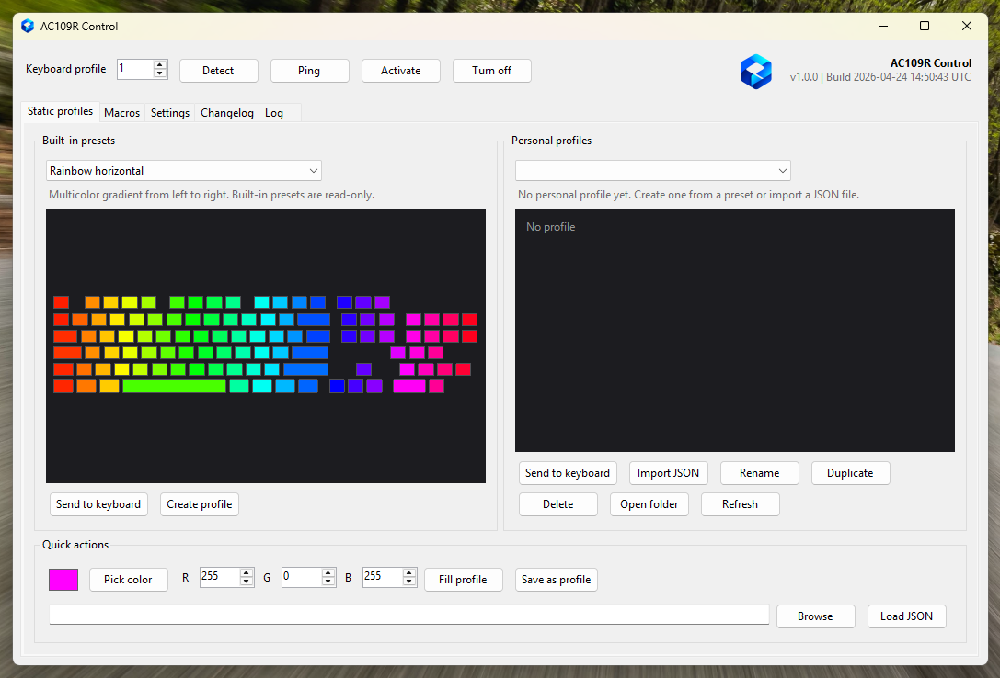
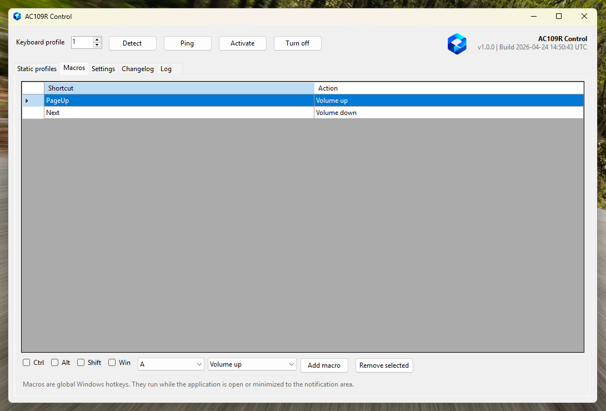

<h1 align="center">AC109R Control</h1>

<p align="center">
  <strong>A lightweight Windows controller for the ACGAM AC-109R keyboard lighting profiles and software macros.</strong>
</p>

<p align="center">
  
  
  
  
  
  
  
</p>

## Overview

AC109R Control is a small Windows application for the ACGAM AC-109R keyboard. It is designed as a stable alternative to the official Windows utility for everyday lighting profile control and software media macros.

The USB lighting protocol implementation is based on the reverse-engineering work from [`franlego98/ac109rdriverlinux`](https://gitlab.com/franlego98/ac109rdriverlinux).

## Screenshots

<p align="center">
  
</p>

<p align="center">
  
</p>

## Features

### Lighting Profiles

- Select and control the three onboard keyboard profile slots.
- Send built-in static presets such as rainbow, aurora, ocean, fire, warm white, and AC109 magenta.
- Create editable personal profiles from built-in presets.
- Import, rename, duplicate, delete, and open personal JSON profiles from the interface.
- Fill the selected keyboard profile with a custom RGB color.
- Save the current quick RGB color as a new personal profile.

### Software Macros

The macro tab registers global Windows hotkeys while AC109R Control is running. Supported actions are:

- volume up
- volume down
- mute volume
- play / pause
- next track
- previous track

These macros are software-level Windows shortcuts. They do not rewrite the keyboard's internal macro memory because that part of the official protocol is not documented in the original Linux driver.

### Windows Behavior

- Optional startup with Windows for the current user.
- Optional minimized startup when launched by Windows.
- Notification area icon to keep macros active in the background.
- Single-instance guard to prevent two copies from running at the same time.
- French and English interface, configurable from the Settings tab.

Administrator privileges are not required for normal use. Running elevated should only be needed for troubleshooting unusual HID access issues.

## JSON Profiles

Editable profiles are stored in:

```text
%LOCALAPPDATA%\AC109RDriverWin\Profiles
```

The JSON format follows the original Linux driver convention:

```json
{
  "esc": [255, 0, 255, 255],
  "f1": [255, 0, 255, 255],
  "space": [255, 255, 255, 255]
}
```

Supported value shapes:

- `[brightness]` applies the same value to red, green, blue, and alpha
- `[red, green, blue]` creates an opaque RGB color
- `[red, green, blue, alpha]` creates an explicit RGBA key color

## Release Notes

### 1.0.0 - 2026-04-24

- First stable release of AC109R Control.
- Added built-in static presets and personal JSON profile management.
- Added quick RGB fill and save-as-profile actions.
- Added global software macros for volume and media controls.
- Added French / English interface settings.
- Added Windows startup, minimized startup, tray icon, and single-instance behavior.

## Build

Requirements:

- Windows
- Visual Studio with the .NET Framework 4.8 targeting pack
- MSBuild

Build from the solution directory:

```powershell
msbuild AC109RWinForms.sln /p:Configuration=Release /p:Platform="Any CPU"
```

The executable is generated at:

```text
bin\Release\Ac109RDriverWin.exe
```

## Technical Notes

The keyboard is accessed through the Windows HID API. No external NuGet package is required.

Known device identifiers:

```text
VID: 0x1EA7
PID: 0x0907
Preferred HID interface: MI_01
Packet length: 64 bytes
CRC: CCITT, start value 0xFFFF
```

The application writes the same profile stream structure used by the Linux project:

1. Optional profile clear
2. Stream header
3. Base key data
4. Per-key RGBA data
5. Zero padding
6. Stream close
7. Profile activation

## Limitations

- Firmware-native dynamic lighting effects are not implemented yet.
- Macro support is implemented with Windows global hotkeys, not firmware-level keyboard macro programming.
- The original public Linux project documents lighting profiles, not the complete official Windows software feature set.
- If the official AC109R software is running, it may lock the HID interface. Close it before using this application.

## Credits

This project builds on the protocol research and Linux implementation by Francisco Sanchez Lopez:

- GitLab: [`franlego98/ac109rdriverlinux`](https://gitlab.com/franlego98/ac109rdriverlinux)

CRC logic is a C# port of the CCITT algorithm used by the original project.

## License

This project is distributed under the GPL-3.0 license, matching the original AC109R Linux driver license.